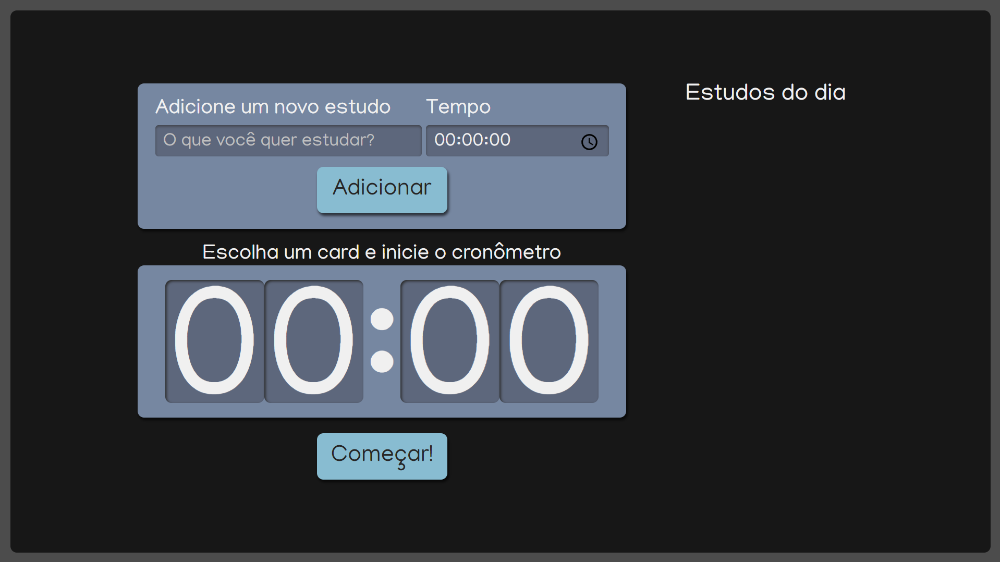

# Getting Started with Create React App

This project was bootstrapped with [Create React App](https://github.com/facebook/create-react-app). It was developed by Fabio with the help from another Alura course.
In this site, you can put whatever activity and the time you wanna do. After selected the activity, you can start run the timer and have a time control on what are you doing.

## ✔️ Techniques and technologies used:

This site used the following technologies:

- `React` 
- `SCSS`
- `TypeScript`

## Available Scripts

In the project directory, you can run:

### `npm start`

Runs the app in the development mode.\
Open [http://localhost:3000](http://localhost:3000) to view it in the browser.

The page will reload if you make edits.\
You will also see any lint errors in the console.